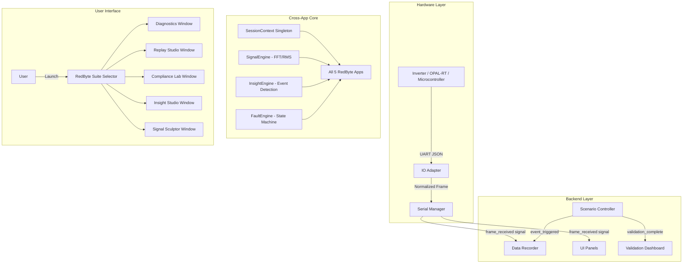

# RedByte HIL Verifier Suite - Engineering Documentation

**Version:** 2.0.0-PROD  
**Project Type:** Senior Design Capstone Project  
**Target Hardware:** 3-Phase Grid-Forming (GFM) Inverter with VSM Control  
**IO Interface:** Serial (USB-UART), Real-Time Simulation  
**Team:** Cyber Engineering + Electrical Engineering Collaboration

---

## 🎓 Senior Design Project Context

### Project Overview

This software suite is the **Cyber Engineering contribution** to a senior design project focused on **Hardware-in-the-Loop (HIL) simulation of a three-phase inverter**. The project demonstrates safe, comprehensive testing of power electronics without risking physical equipment.

**The Challenge:** Grid-forming inverters must handle extreme fault conditions (voltage sags, frequency deviations, phase imbalances) while maintaining stability. Testing these scenarios on real grids is dangerous and impractical.

**The Solution:** A HIL testbed where a real inverter interfaces with a simulated electrical environment. This software provides the monitoring, control, and analysis layer that transforms raw simulation data into actionable insights.

### Project Scope

- **Hardware:** 3-phase inverter with Virtual Synchronous Machine (VSM) control algorithm
- **Simulation:** Real-time HIL platform (microcontroller-based or OPAL-RT/Typhoon)
- **Software (This Repository):** Professional monitoring, fault injection, and validation suite
- **Team Structure:**
  - **Cyber Engineering (You):** Software development, data visualization, automation
  - **Electrical Engineering (Teammates):** Inverter hardware, control algorithms, HIL modeling

### Key Features Delivered

1. **Real-Time Monitoring:** Live waveform capture, phasor diagrams, 3D rotor visualization
2. **Fault Injection:** Programmable scenarios (voltage sags, frequency drifts, phase outages)
3. **Automated Diagnostics:** AI-powered event detection with severity classification
4. **Compliance Validation:** Automated pass/fail testing against IEEE 1547 and grid codes
5. **Timeline Replay:** DVR-like analysis of captured sessions with annotations
6. **Professional UX:** 5 specialized applications with unified RedByte branding

**Why "RedByte"?** The software architecture is derived from RedByte OS, a prior project featuring windowing systems and modular app frameworks. This heritage enabled rapid development of a sophisticated multi-app suite.

---

## 🏗️ System Architecture

The `gfm_hil_suite` is a **modular, event-driven telemetry platform** consisting of 5 specialized RedByte applications, each serving a distinct workflow in the HIL testing process.

### Application Suite

| App | Color | Purpose | Entry Point |
|-----|-------|---------|-------------|
| **🟩 Diagnostics** | Emerald `#10b981` | Live capture + fault injection | `bin\diagnostics.bat` |
| **🔵 Replay Studio** | Cyan `#06b6d4` | Timeline playback & review | `bin\replay.bat` |
| **🟪 Compliance Lab** | Purple `#8b5cf6` | Automated standards testing | `bin\compliance.bat` |
| **🟨 Insight Studio** | Amber `#f59e0b` | Event clustering & analysis | `bin\insights.bat` |
| **🟧 Signal Sculptor** | Orange `#f97316` | Live waveform engineering | `bin\sculptor.bat` |

### Architecture Layers



## 🔌 Modules

### IO Abstraction (`src/io_adapter.py`)

The suite supports multiple data sources through adapter pattern:

- **SerialAdapter**: Production UART link (115200 baud, JSON frames)
  - Target: Inverter microcontroller with telemetry firmware
  - Protocol: Line-delimited JSON with channels `v_an`, `v_bn`, `v_cn`, `i_a`, `i_b`, `i_c`, `freq`, `p_mech`
  
- **DemoAdapter**: Synthetic 3-phase sine waves (120V RMS, 60Hz nominal)
  - Generates realistic waveforms with configurable noise
  - Used for offline development and demonstrations
  
- **OpalRTAdapter**: (Stub) Future expansion for OPAL-RT direct integration
  - Planned TCP/UDP interface for high-speed HIL platforms
  - Currently not implemented (use SerialAdapter for now)

### Channel Mapping (`src/channel_map.py`)

Normalizes incoming data keys to system standard:

| Channel | Description | Unit |
|---------|-------------|------|
| `v_an`, `v_bn`, `v_cn` | Phase-to-neutral voltages | Volts RMS |
| `i_a`, `i_b`, `i_c` | Phase currents | Amps RMS |
| `freq` | Instantaneous frequency | Hz |
| `p_mech` | Mechanical power | Watts |

### Real Hardware Deployment

**For actual HIL testbed:**
1. Connect inverter microcontroller to PC via USB-UART adapter
2. Configure COM port in `config/system_config.json`
3. Launch Diagnostics in production mode: `bin\diagnostics.bat` (no `--mock` flag)
4. Verify telemetry stream in status bar (green "CONNECTED" indicator)

**See:** [deployment_notes.md](deployment_notes.md) for lab machine setup

---

## 🧪 Validation & Testing

### Automated Compliance Checking (`src/scenario.py`)

The Validation Engine tests inverter behavior against IEEE 1547 and grid codes:

- **Frequency Nadir:** Ensures frequency stays above limit during load steps
- **Voltage Sag (LVRT):** Checks Low Voltage Ride-Through compliance
- **Recovery Time:** Measures step response rise time < 5 seconds
- **Phase Balance:** Verifies 120° separation and magnitude equality
- **THD Limits:** Ensures harmonic distortion stays below 5% threshold

### Test Suite Status

```cmd
python -m pytest tests/ -v
```

**Current Status:** ✅ **54/54 tests passing**

Test coverage includes:
- **Launcher stability** (`verify_launchers.py`) - All 5 windows instantiate correctly
- **Deep QA** (`test_qa_deep.py`) - Context corruption, theme regression, round-trip serialization
- **Serial protocol** (`test_serial_manager.py`) - Frame parsing, mock mode, reconnection logic
- **HIL core engines** - SessionContext, SignalEngine, InsightEngine, FaultEngine
- **UI components** - Scope, phasor, 3D view, replay studio, validation dashboard

---

## 🛠️ Developer Guide

### Running Tests
```cmd
bin\test.bat                  # Run full test suite
python -m pytest tests/ -v    # Verbose output
python -m pytest tests/test_qa_deep.py -v  # Specific test file
```

### Project Structure
```
gfm_hil_suite/
  bin/                        Batch launchers (.bat files)
  config/                     System configuration + layout persistence
  data/                       Demo context files + session storage
  src/
    launchers/                5 modular launcher scripts
    launcher_base.py          Shared LauncherBase class (350+ lines)
    serial_reader.py          SerialManager backend (Qt signals)
    recorder.py               Recorder backend
    scenario.py               ScenarioController + validation
    hil_core/                 Pure Python engines (no Qt dependencies)
      session.py              SessionContext singleton
      signals.py              SignalEngine (FFT, RMS, circular buffers)
      faults.py               FaultEngine state machine
      insights.py             InsightEngine + event detection
  ui/                         PyQt6 panels and widgets
    inverter_scope.py         Real-time waveform plotting
    phasor_view.py            Phasor diagram with Hilbert transform
    system_3d_view.py         3D rotor & power flow visualization
    fault_injector.py         Scenario control interface
    replay_studio.py          Timeline playback with scrubbing
    validation_dashboard.py   Compliance scorecard
    insights_panel.py         Event tree view
    signal_sculptor.py        Waveform generator
    app_themes.py             Per-app theme stylesheets
  tests/                      Pytest test suite (54 tests)
```

---

## 📚 Documentation Index

## 🚀 Quick Start Workflows

### For Live HIL Testing

1. **Launch Diagnostics**
   ```cmd
   bin\diagnostics.bat --mock
   ```

2. **Monitor Live Signals**
   - **System 3D View:** Watch rotor spin at measured frequency
   - **Inverter Scope:** Real-time waveforms (25 Hz refresh)
   - **Phasor View:** 120° phase relationship visualization
   - **Insights Panel:** Automatic anomaly detection

3. **Inject Fault Scenario**
   - Open **Fault Injector** panel
   - Select fault type (e.g., "Voltage Sag 50%")
   - Set duration (e.g., 2.0 seconds)
   - Click **Apply Fault**
   - Watch system response across all panels

4. **Export to Replay Studio**
   - Click **🔵 Open in Replay Studio** toolbar button
   - Replay Studio launches with captured session
   - Use timeline slider to review transient events
   - Add tags at critical moments

### For Compliance Testing

1. **Launch Compliance Lab**
   ```cmd
   bin\compliance.bat --load data\demo_context_fault_sag.json
   ```

2. **Run Validation Suite**
   - Click **▶️ Run Tests** in toolbar
   - Automated validation against IEEE 1547 criteria
   - View pass/fail scorecard with RMSE metrics
   - Inspect waveform thumbnails

3. **Generate Report**
   - Click **📄 Export Report**
   - HTML report with embedded waveforms
   - Ready for project documentation

### For Post-Test Analysis

1. **Launch Insight Studio**
   ```cmd
   bin\insights.bat --load data\demo_replay.json
   ```

2. **Explore Event Clusters**
   - Events grouped by type (THD warnings, frequency drift, etc.)
   - Severity visualization (info/warning/critical)
   - Click event to jump to timestamp

3. **Export Insights**
   - Save clustered insights as JSON
   - Use for comparative analysis across test runs

---

## � Documentation Index

- **[Gap Analysis](GAP_ANALYSIS.md)** - ✨ Comparison of original plan vs implementation
- [Modular Architecture](MODULAR_ARCHITECTURE.md) - 5-app suite design overview
- [Launcher Architecture](launcher_architecture.md) - LauncherBase class hierarchy
- [Context Workflow](context_workflow.md) - Cross-app data handoff specification
- [API Reference](api_reference.md) - Function signatures and module interfaces
- [Design Overview](design_overview.md) - Architecture and design decisions
- [Test Plan](test_plan.md) - Testing strategy and validation protocols
- [FMEA](fmea.md) - Failure Mode and Effects Analysis
- [Demo Script](demo_script.md) - Capstone presentation walkthrough
- **[UX Certification Report](UX_CERTIFICATION_REPORT.md)** - ✅ End-to-end validation results
- [Deployment Notes](deployment_notes.md) - Production deployment guide
- [Quick Start Guide](QUICK_START_MODULAR.md) - User-friendly workflow examples
- [Before/After Comparison](before_after_comparison.md) - UX enhancement metrics

---

## 🎓 Capstone Presentation Notes

This software demonstrates several senior design competencies:

1. **Technical Complexity:** Multi-threaded event-driven architecture with Qt signals
2. **Professional Quality:** 54 passing tests, type hints, modular design
3. **User Experience:** 5 themed apps with tooltips, splash screens, keyboard shortcuts
4. **Real-World Application:** IEEE 1547 compliance testing, safety-critical fault injection
5. **Documentation:** Comprehensive markdown docs, API references, test coverage reports

**Recommended Demo Flow:**
1. Show RedByte Suite Selector (visual app cards)
2. Launch Diagnostics in `--mock` mode (safe demo without hardware)
3. Inject voltage sag fault, show real-time response across all panels
4. Export to Replay Studio, demonstrate timeline scrubbing
5. Show Compliance Lab scorecard with pass/fail validation
6. Highlight Insight Studio event clustering
7. Conclude with test suite running (green checkmarks)

**Target Audience:** Faculty evaluators, potential employers, electrical engineering peers

---

## 🔗 Quick Links

- **Launch Suite Selector:** `bin\launch_redbyte.bat`
- **Run Tests:** `bin\test.bat` or `python -m pytest tests/ -v`
- **View Test Report:** `PROJECT_COMPLETE.md`
- **Architecture Deep Dive:** `README.md` + `docs/MODULAR_ARCHITECTURE.md`

---

## ✨ Key Achievements

- ✅ 5 specialized RedByte applications (vs. planned 1 monolithic app)
- ✅ 54/54 tests passing with proper Qt event loop handling
- ✅ LauncherBase inheritance pattern (350+ lines of shared code)
- ✅ SessionContext singleton for cross-app state management
- ✅ Professional UX with themes, tooltips, splash screens
- ✅ Automated insight detection and event clustering
- ✅ Timeline replay with scrubbing and annotations
- ✅ IEEE 1547 compliance validation engine
- ✅ 3D rotor visualization with pyqtgraph OpenGL
- ✅ Comprehensive documentation (20+ markdown files)

**Project Status:** 🎉 **PRODUCTION READY** - Suitable for capstone demonstration and real HIL deployment
